# Web Privacy & Stateful Tracking — Complete Lab Report

**Course / Module:** Information Security — Web Privacy TP1  
**Topic:** Stateful Web Tracking, First-Party & Third-Party Cookies, Analytics & Cookie Syncing  
**Student / Author:** Imad BOUTBAOUCHT  

---

## 1. Environment Setup & Architecture

### 1.1 Overview
Web privacy relies heavily on understanding how HTTP servers identify returning users across requests. Because HTTP is inherently stateless, servers use mechanisms like HTTP cookies, JavaScript storage, and HTTP redirects to maintain user state and track activity.

### 1.2 Hostname Configuration & Local Domains
To simulate realistic multi-domain tracking scenarios locally, domain names were mapped to `127.0.0.1` in the system hosts file (`/etc/hosts`):

```text
127.0.0.1   lab.test
127.0.0.1   publisher-one.test
127.0.0.1   publisher-two.test
127.0.0.1   tracker-one.test
127.0.0.1   tracker-two.test
127.0.0.1   analytics.test
```

### 1.3 Project Directory Structure
```text
statefulTracking/
├── venv/
├── Warm-Up/
│   └── app.py
├── Challenge-1/
│   ├── publisher-one/ (app.py, templates/index.html)
│   ├── publisher-two/ (app.py, templates/index.html)
│   └── tracker-one/   (app.py, templates/tracker.html)
├── analytics-server/
│   ├── app.py
│   └── static/analytics.js
├── tracker-one/ (Cookie Sync Redirector)
│   └── app.py
└── tracker-two/ (Cookie Sync Receiver)
    └── app.py
```

---

## 2. Warming Up — Inspecting HTTP Headers & Cookie Attributes

### 2.1 HTTP Request & Response Headers
HTTP requests consist of headers sent by the browser (client) and response headers returned by the server. Custom headers can be injected by servers for metadata or tracking.

#### Server Code (`Warm-Up/app.py`)
```python
from flask import Flask, render_template, request, make_response
import secrets

app = Flask(__name__)

@app.route("/")
def home():
    response = make_response(render_template("index.html"))
    response.headers["X-Lab-Message"] = "Hello from the Flask server"
    
    print("\n--- HTTP REQUEST HEADERS ---")
    print(request.headers)
    print("--- HTTP RESPONSE HEADERS ---")
    print(response.headers)
    return response

if __name__ == "__main__":
    app.run(host="127.0.0.1", port=8000, debug=True)
```

#### Observations & Verification
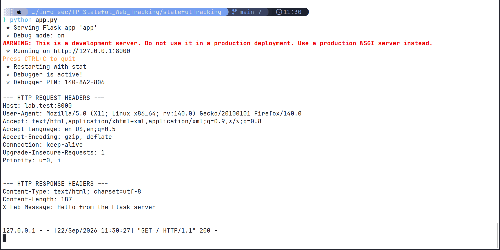

When requesting `http://lab.test:8000`, the server receives client headers (`Host`, `User-Agent`, `Accept`, `Accept-Language`, `Connection`) and transmits custom response headers (`X-Lab-Message: Hello from the Flask server`).

---

### 2.2 Manipulating Cookies & Security Attributes
To recognize returning visitors, the server sets a cookie containing a unique identifier (`aid = secrets.token_hex(8)`).

#### Setting the Cookie (`Set-Cookie`)
```python
aid = request.cookies.get("aid")
if aid is None:
    aid = secrets.token_hex(8)
    response = make_response(render_template("index.html"))
    response.set_cookie(key="aid", value=aid, httponly=True, max_age=31536000, samesite='Lax')
```

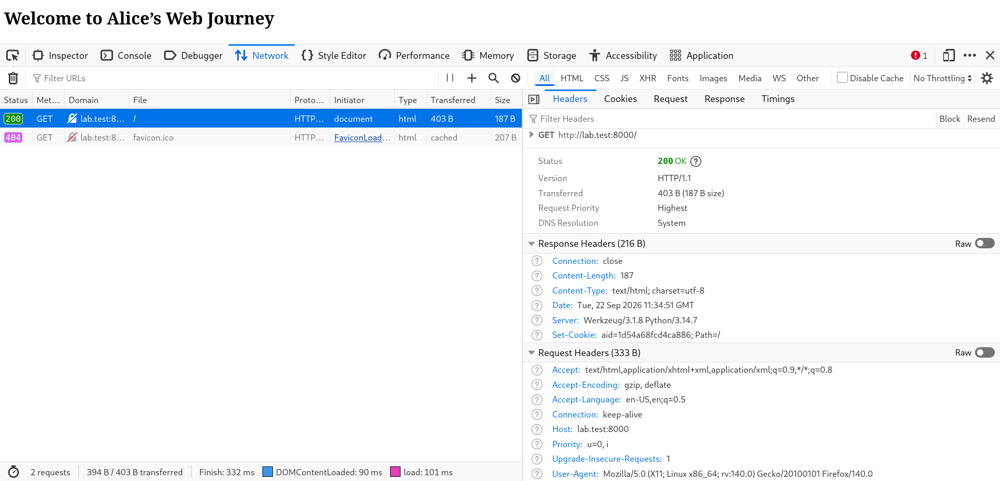

---

### 2.3 Analysis of Cookie Attributes

| Attribute | Purpose & Security Impact | Observations in Lab |
| :--- | :--- | :--- |
| **Expires / Max-Age** | Defines cookie lifespan. Without it, the cookie is a *Session Cookie* and is deleted when browser closes. Setting `max_age` makes it a *Persistent Cookie*. | When `max_age` was added, the cookie persisted even after restarting the browser. |
| **HttpOnly** | Prevents client-side scripts (JavaScript) from accessing `document.cookie`. Protects against session hijacking via XSS attacks. | When `HttpOnly=True`, `document.cookie` in DevTools Console returned an empty string `''`. |
| **SameSite** | Controls whether cookies are sent with cross-site requests (`Strict`, `Lax`, or `None`). | `SameSite=None` requires `Secure=True` in modern browsers for third-party contexts. |
| **Secure** | Restricts cookie transmission to encrypted HTTPS connections only. | In HTTP testing, `Secure` cookies are withheld by the browser unless HTTPS is enabled. |
| **Domain / Path** | Defines origin scope. Restricts cookie availability to specific domain hierarchies and paths. | Default path `/` makes the cookie accessible across the entire domain origin. |

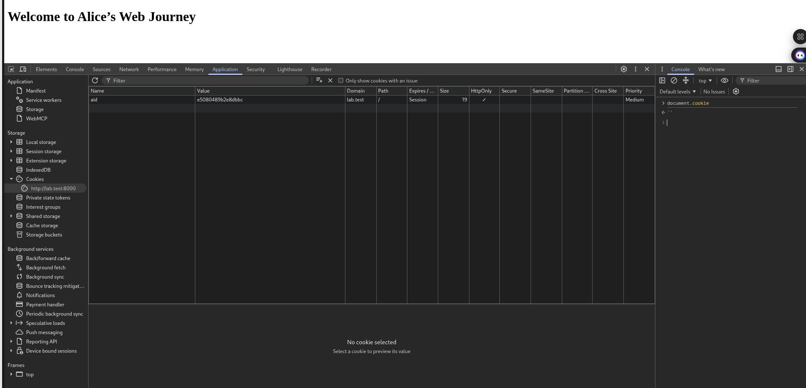

---

## 3. Challenge 1 — Third-Party Tracking via Embedded IFrames

### 3.1 Concept & Mechanics
A **Third-Party Cookie** occurs when a browser requests a resource (such as an `<iframe>`, ``, or `<script>`) hosted on a domain different from the domain in the address bar.

In Challenge 1:
- `publisher-one.test:8001` (Tech News) embeds `<iframe src="http://tracker-one.test:9001/?publisher=publisher-one"></iframe>`.
- `publisher-two.test:8002` (Travel Blog) embeds `<iframe src="http://tracker-one.test:9001/?publisher=publisher-two"></iframe>`.

---

### 3.2 Observations & Browsing Profile Reconstruction

#### Publisher 1 Visit
When visiting Publisher 1, the browser loads the iframe from `tracker-one.test:9001`. The tracker server generates a persistent cookie (`tracker_id=aa2273159b22ad25`) and sends it back in `Set-Cookie`.

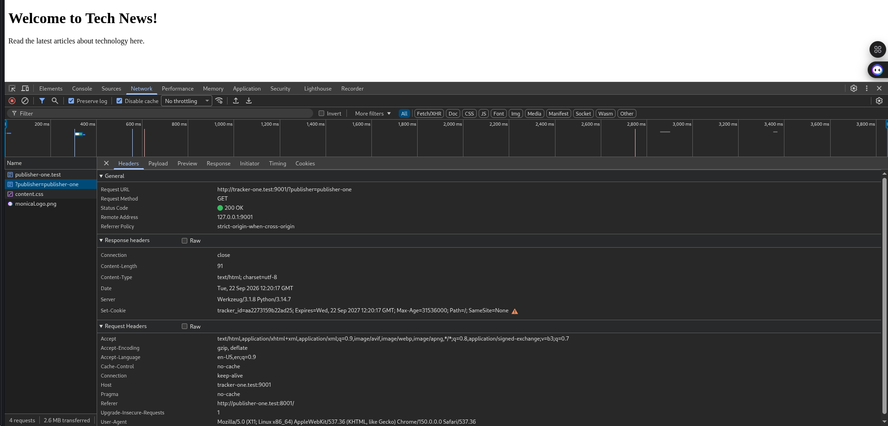

#### Publisher 2 Visit
When the user subsequently navigates to Publisher 2, the embedded iframe again points to `tracker-one.test:9001`. Because the cookie `tracker_id` belongs to `tracker-one.test`, the browser automatically includes it in the `Cookie` request header.

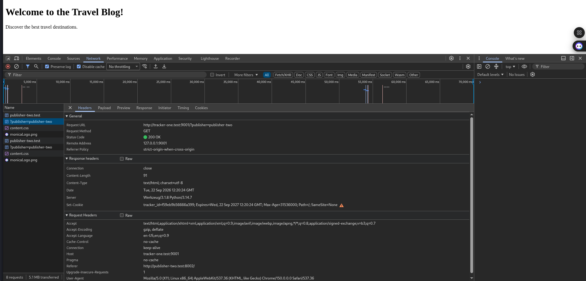

#### Reconstructed Tracking Log
Because `tracker-one` receives the same persistent identifier across both distinct publisher websites, it reconstructs a unified chronological browsing history:

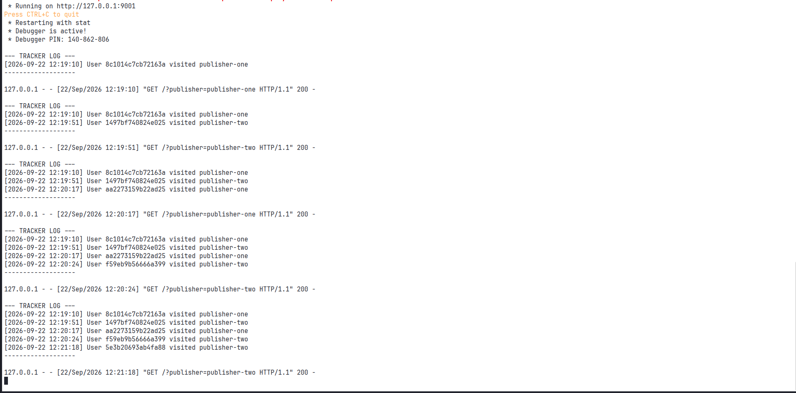

```text
--- TRACKER LOG ---
[2026-09-22 12:19:10] User 8c1014c7cb72163a visited publisher-one
[2026-09-22 12:19:51] User 1497bf740824e025 visited publisher-two
[2026-09-22 12:20:17] User aa2273159b22ad25 visited publisher-one
[2026-09-22 12:20:24] User aa2273159b22ad25 visited publisher-two
```

---

## 4. Challenge 2 — First-Party Analytics

### 4.1 Concept & Setup
Modern web browsers increasingly block or partition third-party cookies. To bypass this restriction, web analytics services (e.g., Google Analytics) provide JavaScript snippets that publishers embed directly into their pages:

```html
<script src="http://analytics.test:9100/static/analytics.js"></script>
```

Although the script file is downloaded from `analytics.test`, **it executes within the first-party context of the publisher's page**. Thus, any cookie it creates via `document.cookie` is a **First-Party Cookie** belonging to the publisher's domain (`publisher-one.test` or `publisher-two.test`).

---

### 4.2 Technical Observations

#### Publisher 1 (`publisher-one.test:8001`)
The script executes, checks for `_analytics_id`, finds none, and generates `user_w2tao5194`. The cookie is scoped to `publisher-one.test`.

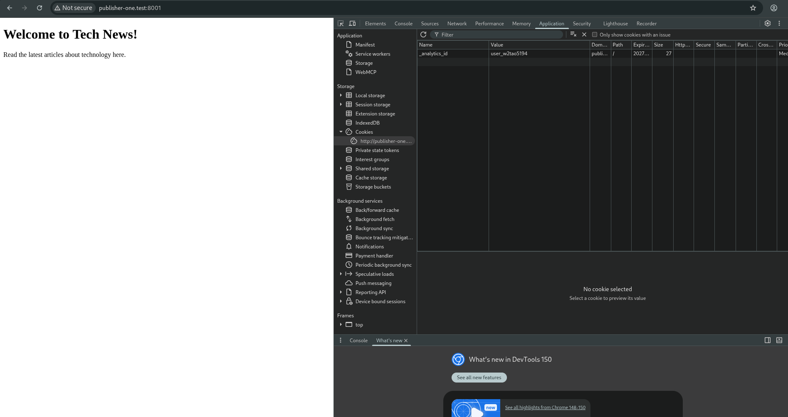

#### Publisher 2 (`publisher-two.test:8002`)
When the user visits Publisher 2, `analytics.js` executes in `publisher-two.test`'s origin context. Due to the browser's **Same-Origin Policy**, JavaScript running on `publisher-two.test` cannot read cookies set on `publisher-one.test`. Therefore, it generates a completely new identifier (`user_8d72ly93w`).

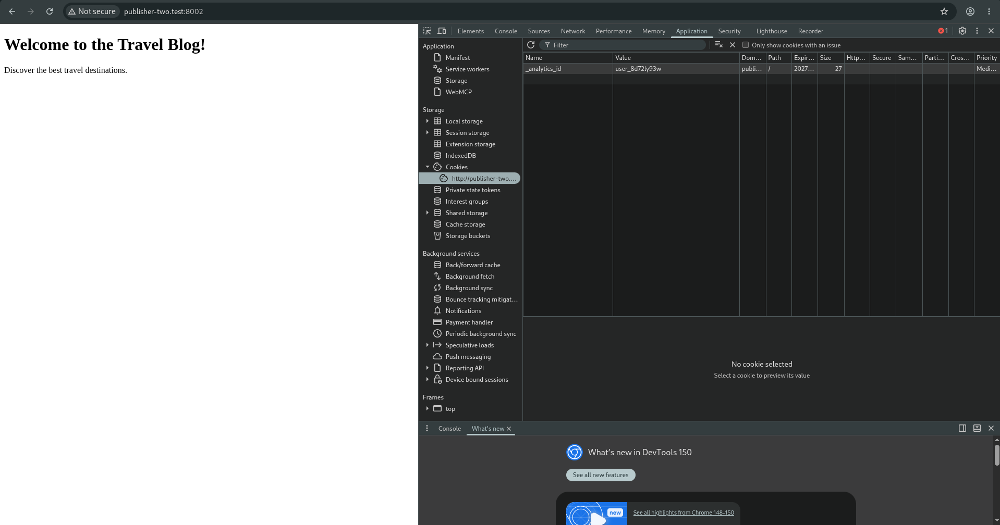

#### Analytics Server Log
The analytics server receives requests from tracking pixels (`http://analytics.test:9100/track?publisher=...&aid=...`). Because the IDs generated by the script on each publisher differ, the analytics server records two distinct, unlinked profiles.

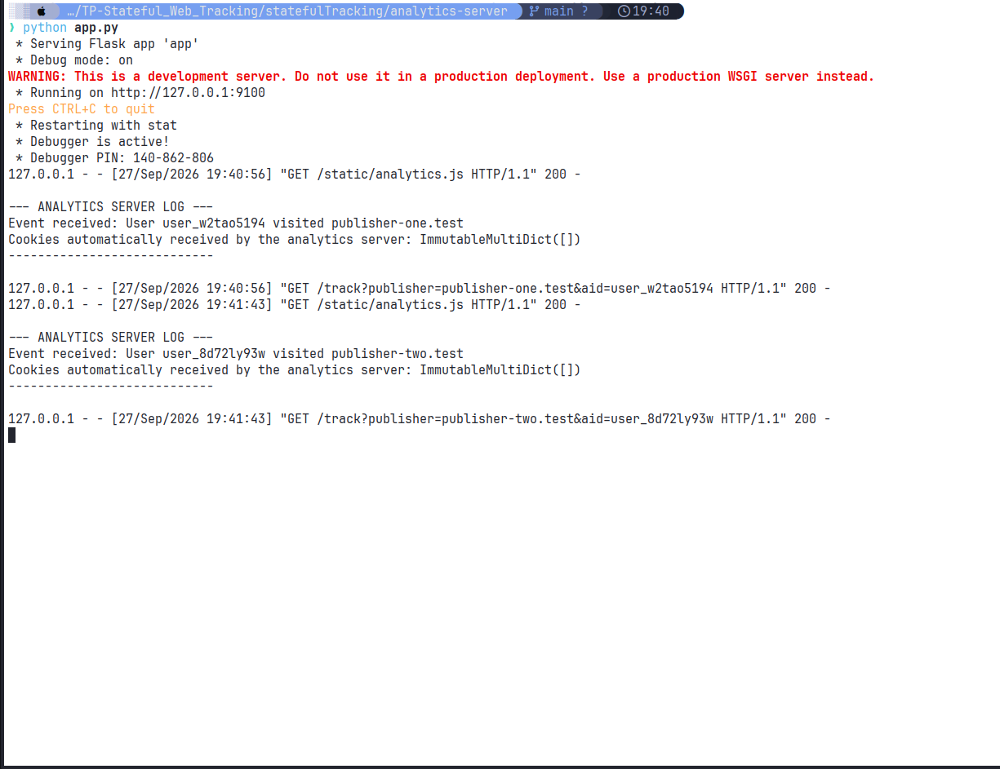

---

### 4.3 Detailed Answers to Challenge 2 Questions

#### Q1: Are the two publishers assigned the same identifier or different identifiers?
**Answer:** They are assigned completely **different identifiers** (`user_w2tao5194` on Publisher 1 vs `user_8d72ly93w` on Publisher 2).

#### Q2: Why does this behavior occur?
**Answer:** The script executes inside the publisher's origin context using `document.cookie`. Cookies created via `document.cookie` are bound to the current page origin (`publisher-one.test` vs `publisher-two.test`). Under the browser's Same-Origin Policy (SOP), web pages from `publisher-two.test` are strictly isolated from reading storage or cookies belonging to `publisher-one.test`.

#### Q3: Does the analytics server automatically receive the first-party cookies created in the publishers’ contexts?
**Answer:** **No.** An HTTP server only automatically receives cookies that belong to its own domain (`analytics.test`). Because the `_analytics_id` cookie is stored under the publisher's domain, the browser does not attach it to HTTP requests sent to `analytics.test`. The analytics server only received the identifier because our JavaScript explicitly read `document.cookie` and appended it as a URL query parameter (`?aid=user_...`) on the tracking pixel request.

#### Q4: Does the analytics service create one combined profile or multiple separate profiles?
**Answer:** It creates **multiple separate profiles**. Without cross-domain identifier sharing, the analytics server observes requests from `user_w2tao5194` on Publisher 1 and `user_8d72ly93w` on Publisher 2 as two completely unrelated users.

---

## 5. Challenge 7 — Cookie Syncing

### 5.1 Concept & Mechanism
Because first-party cookies are isolated per publisher domain, third-party advertising networks use **Cookie Syncing** to pass local identifiers between different domains using HTTP redirects (`302 FOUND`) and URL parameter passing.

---

### 5.2 Cookie Syncing Protocol Flow

```text
[ Browser ] ─── (1) Visit publisher-one.test ───> [ Publisher 1 ]
[ Browser ] ─── (2) GET http://tracker-one.test:9001/sync ───> [ Tracker 1 ]
             <── (3) HTTP 302 Redirect to:
                 http://tracker-two.test:9002/sync_receive?partner_id=19a5...
                 + Set-Cookie: tracker1_id=19a5...
[ Browser ] ─── (4) GET http://tracker-two.test:9002/sync_receive?partner_id=19a5...
                 + Cookie: tracker2_id=692e... ───> [ Tracker 2 ]
                                                      │
                                                      └─ Stores link:
                                                         sync_db["692e..."] = "19a5..."
```

---

### 5.3 Technical Verification & Observations

#### Step 1: The 302 HTTP Redirect Trick
When the browser requests the tracking resource from `tracker-one.test:9001`, `tracker-one` reads or sets its cookie (`tracker1_id = f4321f9b0269d3ac`). It then returns a `302 FOUND` status with a `Location` header pointing to `tracker-two.test:9002/sync_receive?partner_id=f4321f9b0269d3ac`.

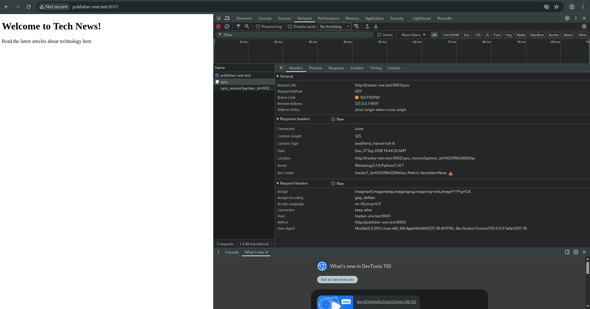

#### Step 2: Database Identity Linking
The browser follows the redirect to `tracker-two.test:9002`. During this request:
1. `tracker-two` receives its own cookie (`tracker2_id = 692e1df509bb38de`).
2. `tracker-two` extracts `partner_id = 19a5b6534e53f5ad` from the URL parameter.
3. `tracker-two` maps the two IDs in its internal database (`sync_db[my_id] = partner_id`).

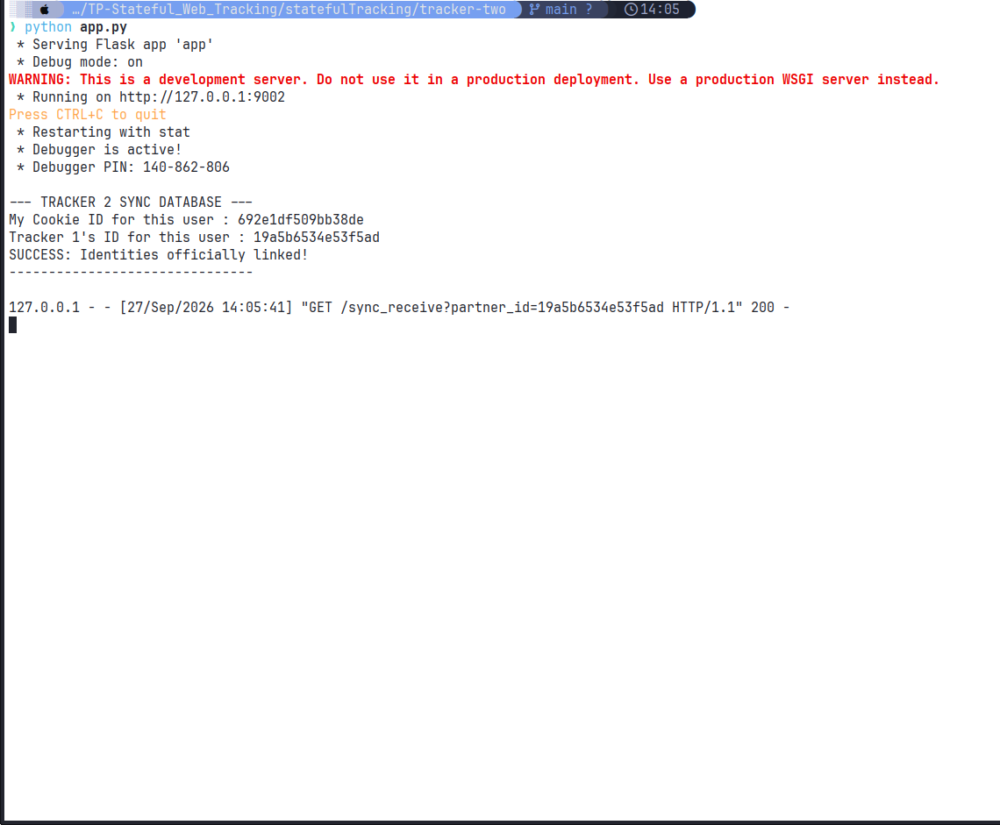

```text
--- TRACKER 2 SYNC DATABASE ---
My Cookie ID for this user : 692e1df509bb38de
Tracker 1's ID for this user : 19a5b6534e53f5ad
SUCCESS: Identities officially linked!
-------------------------------
```

This protocol effectively bypasses first-party cookie isolation by allowing ad networks to synchronize and merge user profiles behind the scenes.

---

## 6. Source Code Appendix

### 6.1 Challenge 1 Source Code

#### `Challenge-1/publisher-one/app.py`
```python
from flask import Flask, render_template

app = Flask(__name__)

@app.route("/")
def home():
    return render_template("index.html")

if __name__ == "__main__":
    app.run(host="127.0.0.1", port=8001, debug=True)
```

#### `Challenge-1/publisher-one/templates/index.html`
```html
<!DOCTYPE html>
<html>
<head><title>Tech News - Publisher 1</title></head>
<body>
<h1>Welcome to Tech News!</h1>
<p>Read the latest articles about technology here.</p>
<iframe src="http://tracker-one.test:9001/?publisher=publisher-one" style="display:none;"></iframe>
</body>
</html>
```

#### `Challenge-1/tracker-one/app.py`
```python
from flask import Flask, request, make_response, render_template
import secrets

app = Flask(__name__)
tracking_logs = []

@app.route("/")
def track():
    publisher = request.args.get("publisher", "unknown")
    tid = request.cookies.get("tracker_id")
    is_new = tid is None
    
    if is_new:
        tid = secrets.token_hex(8)
        
    tracking_logs.append({"user": tid, "publisher": publisher})
    
    print("\n--- TRACKER LOG ---")
    for log in tracking_logs:
        print(f"User {log['user']} visited {log['publisher']}")
    print("-------------------\n")
    
    response = make_response(render_template("tracker.html"))
    if is_new:
        response.set_cookie("tracker_id", tid, max_age=31536000, samesite='None', secure=False)
    return response

if __name__ == "__main__":
    app.run(host="127.0.0.1", port=9001, debug=True)
```

---

### 6.2 Challenge 2 Source Code

#### `analytics-server/static/analytics.js`
```javascript
(function() {
    function getCookie(name) {
        let match = document.cookie.match(new RegExp('(^| )' + name + '=([^;]+)'));
        if (match) return match[2];
        return null;
    }

    let aid = getCookie('_analytics_id');
    if (!aid) {
        aid = 'user_' + Math.random().toString(36).substr(2, 9);
        let expiry = new Date();
        expiry.setFullYear(expiry.getFullYear() + 1);
        document.cookie = "_analytics_id=" + aid + "; expires=" + expiry.toUTCString() + "; path=/";
    }

    let publisher = window.location.hostname;
    let trackingPixel = new Image();
    trackingPixel.src = "http://analytics.test:9100/track?publisher=" + encodeURIComponent(publisher) + "&aid=" + encodeURIComponent(aid);
})();
```

#### `analytics-server/app.py`
```python
from flask import Flask, request

app = Flask(__name__, static_folder='static')

@app.route("/track")
def track():
    publisher = request.args.get("publisher")
    aid = request.args.get("aid")
    
    print("\n--- ANALYTICS SERVER LOG ---")
    print(f"Event received: User {aid} visited {publisher}")
    print(f"Cookies automatically received by the analytics server: {request.cookies}")
    print("----------------------------\n")
    
    pixel = b'\x47\x49\x46\x38\x39\x61\x01\x00\x01\x00\x80\x00\x00\xff\xff\xff\x00\x00\x00\x21\xf9\x04\x01\x00\x00\x00\x00\x2c\x00\x00\x00\x00\x01\x00\x01\x00\x00\x02\x02\x44\x01\x00\x3b'
    return pixel, 200, {'Content-Type': 'image/gif'}

if __name__ == "__main__":
    app.run(host="127.0.0.1", port=9100, debug=True)
```

---

### 6.3 Challenge 7 Source Code

#### `tracker-one/app.py` (Redirector)
```python
from flask import Flask, request, make_response, redirect
import secrets

app = Flask(__name__)

@app.route("/sync")
def sync():
    aid = request.cookies.get("tracker1_id")
    is_new = aid is None
    if is_new:
        aid = secrets.token_hex(8)

    redirect_url = f"http://tracker-two.test:9002/sync_receive?partner_id={aid}"
    response = make_response(redirect(redirect_url))
    
    if is_new:
        response.set_cookie("tracker1_id", aid, samesite='None', secure=False)

    return response

if __name__ == "__main__":
    app.run(host="127.0.0.1", port=9001, debug=True)
```

#### `tracker-two/app.py` (Receiver & Database Linker)
```python
from flask import Flask, request, make_response
import secrets

app = Flask(__name__)
sync_db = {}

@app.route("/sync_receive")
def sync_receive():
    partner_id = request.args.get("partner_id")
    my_id = request.cookies.get("tracker2_id")
    is_new = my_id is None
    
    if is_new:
        my_id = secrets.token_hex(8)
        
    if partner_id:
        sync_db[my_id] = partner_id
        
    print("\n--- TRACKER 2 SYNC DATABASE ---")
    print(f"My Cookie ID for this user : {my_id}")
    print(f"Tracker 1's ID for this user : {partner_id}")
    print("SUCCESS: Identities officially linked!")
    print("-------------------------------\n")
    
    pixel = b'\x47\x49\x46\x38\x39\x61\x01\x00\x01\x00\x80\x00\x00\xff\xff\xff\x00\x00\x00\x21\xf9\x04\x01\x00\x00\x00\x00\x2c\x00\x00\x00\x00\x01\x00\x01\x00\x00\x02\x02\x44\x01\x00\x3b'
    response = make_response(pixel)
    response.headers['Content-Type'] = 'image/gif'
    
    if is_new:
        response.set_cookie("tracker2_id", my_id, samesite='None', secure=False)
        
    return response

if __name__ == "__main__":
    app.run(host="127.0.0.1", port=9002, debug=True)
```
